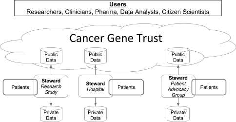
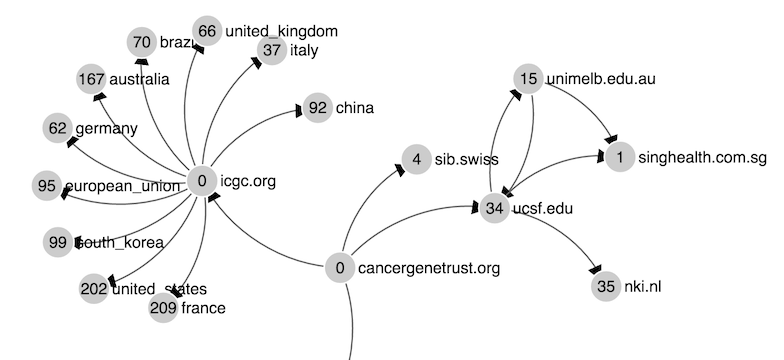

**Background**

The last decade has observed incredible advances in cancer research and medical care, in large part due to the rapid application of genome sequencing technologies, which themselves have undergone significant improvements in efficiency during that time. Ever larger sets of cancer genome sequencing data are being generated and used for medical research, clinical trials, and increasingly, clinical care.

However, almost all of these data are siloed in individual research institutions, with few options to enable sharing or pooling of datasets even when investigators and clinicians are willing to work together, and especially when data are generated across international borders. This approach has resulted in a reality where, despite the advances achieved in cancer genome sequencing, information now languishes in unconnected silos and has begun to [stall the pace](http://www.nature.com/nm/journal/v22/n5/full/nm.4089.html) of progress of precision cancer care. Ultimately, maintaining a robust rate of improvements in care can only be achieved by sustained data sharing.

*The Global Alliance for Genomics and Health and Cancer Data Sharing*

The [Global Alliance for Genomics and Health](http://genomicsandhealth.org) (GA4GH) was established in 2013 to articulate and meet the rising need for tools and standards to facilitate international data sharing across institutions. Since then, the organization has developed multiple tools to support sharing clinical and genomic data, as well as overcoming regulatory and security barriers to sharing through policy making. It has now established itself as a thought leader driving progress to break down such silos by creating a federated data ecosystem that transcends individual nations and institutions. Indeed, a perspective paper detailing this philosophy, as well as progress made since the GA4GH launched was [published in Science](http://science.sciencemag.org/content/352/6291/1278.full) (2016). 

Recognizing its global prevalence and the early sequencing advances made in the field, cancer data sharing has been an early focus of the GA4GH’s efforts. This was first demonstrated with the October 2014 launch of the [BRCA Exchange](http://brcaexchange.org) web portal, which hosts more than 17,000 unique germline variants in BRCA1 and BRCA2, and is the largest repository of publicly available BRCA variation.

Given this initial success in sharing germline variant-level data for two well-studied hereditary cancer syndrome genes, the GA4GH has been motivated to expand its cancer focus to the somatic mutation space. This push has been led first by the work of the Clinical Cancer Genome Task Team, a diverse group of international research and clinical cancer experts, to develop a globally comprehensive cancer data sharing survey.

Building on early results from this survey, the Clinical Cancer Genome Task Team wrote a detailed [perspective](http://www.nature.com/nm/journal/v22/n5/full/nm.4089.html) paper on the global need for somatic cancer mutation data sharing. This paper argued that the GA4GH is unequivocally the best place to develop efforts in this space. The proposal is further supported by GA4GH member involvement in smaller-scale cancer data sharing efforts that have recently been piloted around the world, including AACR’s [GENIE](http://www.aacr.org/Research/Research/Pages/aacr-project-genie.aspx#.V59vmZMrKEI) project, [Cancer Core Europe](http://www.cancercoreeurope.eu), and ASCO’s [CancerLinq](https://cancerlinq.org). Research datasets generated by projects such as the International Cancer Genome Consortium (ICGC) and The Cancer Genome Atlas (TCGA), and national-level data repositories such as the NCI’s Genomic Data Commons and Genomics England, form a solid core of research-generated data. The rapid uptake of gene panel sequencing in routine clinical treatment provides an expanding new source of data. Together these make a compelling case that this is the moment in time for a global somatic cancer data sharing project.

**Motivation**

Along with these efforts, many governments in developed countries have begun cancer sequencing projects, and pool at least some of their data as part of the ICGC. These projects recruit and consent patients, sequence their tumors and follow their treatment and medical interventions to varying extents with dedicated staff and funding. Sequencing is done in a research setting and stored in special access-controlled data centers to comply with data privacy regulations. 

At the same time, outside of the research enterprise, cancer genes are increasingly being sequenced for clinical reasons, e.g. to determine treatment strategies. This sequencing is most often done by clinical testing laboratories; however, even when large regions of the genome are sequenced as a part of clinical testing, only actionable mutations, i.e., mutations that can be used for immediate disease diagnosis and/or treatment, are reported back to the ordering clinician. Thus, for many patient tests, most sequencing results are not analyzed or used, and even the data that are reported back to the hospital rarely make their way back to research. Instead, research must depend on explicit (and very expensive) secondary data gathering efforts such as the projects mentioned above.

If instead of these fractured efforts, all tumor mutations identified by clinical sequencing flowed back to research, then a virtuous cycle would emerge: data from clinical activity would fuel research discoveries, which in turn would lead to more effective clinical care. The Cancer Gene Trust provides an international solution to enable rapid genome-wide somatic cancer data sharing based on a nimble infrastructure to allow local sites to maintain best practices for ethics processes and patient consent. It democratizes data analysis, allowing more experts to participate and compare results, and accelerate the translation of genomic findings towards a clinically useful timescale.

**Project**

The Cancer Gene Trust (CGT) is a simple global network for rapidly storing and sharing somatic cancer data and associated clinical information. It is designed to enable discovery of an unprecedented volume of somatic cancer data by providing open access to a public subset of the data. It enables application builders to focus on using and interpreting the data instead of resolving disparate access methods from multiple sources, or failing entirely because data are simply not available in any format. Such uniform public discovery and access are unprecedented for clinical cancer data sets. Indeed, the CGT facilitates research studies and clinical care on a timescale not previously possible, while allowing data holders to maintain the privacy and security of individual data sources and the non-public subset of the data, and respecting individual patient consents and cultural data sharing preferences and expectations.

Our approach leverages open source technology to create a lightweight, global off-blockchain decentralized network controlled by “stewards” that make limited somatic mutation data and related clinical data about a patient publicly available. A steward can be a hospital, a collection of hospitals, a national database, or any organization that manages health data of patients. The public data include DNA mutations, but are restricted to those mutations that occur only in the tumor (i.e., somatic mutations). We do not make germline DNA information public - it is always stored in a trusted private repository consistent with patient consent. The public data may also include other molecular tests of gene expression levels, protein activation, imaging, and general clinical data such as age of disease onset, cancer type, year of diagnosis, and as much treatment/drug information as the steward is able to share. While the genetic data may not reach the quality and reliability of the centralized research cohorts and data curation infrastructure built for government research projects with dedicated funds, the CGT enables aggregation of data from an order of magnitude more cases, and ultimately may have better clinical data. Data curation and harmonization systems built on top of the CGT provide gradations of data quality and reliability, incorporating user feedback.  

In our model, no identifiable information is shared publicly. A steward is responsible to remove names, addresses, and other personal health information. If a steward wants to enable access requests or re-contact, a link to a patient’s identity can be maintained by including a random number in the submission whose association with the patient is known only to the local steward. The protected patient data, including the raw DNA and RNA sequencing reads, are held only by the steward.

Through this effort, every cancer patient’s tumor genetic tests can potentially be added to the CGT allowing for massive gains in research. On-ramps for data donation can be established at a number of levels, from local community and advocate-driven efforts to national programs. For example, patient data can be entered from local hospitals into the public CGT via an extension of current programs conducted by cancer registries. In the United States, these are programs accredited by the National Cancer Registry Association, and include the NCI Surveillance, Epidemiology, and End Results (SEER) program. The [International Association of Cancer Registries](http://www.iacr.com.fr/) (IACR) lists similar institutions in almost every country.

Worldwide there are 14 million new cancer cases each year, and many will be tested multiple times during the course of the disease. With uptake for even a small percentage of these cases, the CGT can expand rapidly and enable a high impact. Additionally, given the CGT’s ability to scale to accommodate millions of cases, within a relatively short time the CGT could be one of the largest sources of somatic cancer data.

**Submissions**

An individual submission to the CGT may consist of somatic mutation, gene expression, imaging and related clinical data about an individual patient. The steward is responsible to ensure these data do not include identifiable information. Sharing data is not free; being a steward requires some work. Collecting this information in a hospital setting requires some time and effort. To minimize the cost and reduce the manual work to a minimum, we have developed prototype software for staff from two separate departments:

1) The clinic or clinical lab. This is the department from which the tissue sample is sent to the testing company, and that receives the results. We provide software so that the clinical lab’s technicians can extract from the test results only the mutations that occur specifically in the tumor, as well as gene expression levels, protein activation data and other clinical test results when available. The software extracts and submits the limited data to the CGT automatically with just a few clicks. 

2) The cancer registrar. In most larger hospitals, a registrar collects general clinical data about patients, summarizes them and reports them to state or federal authorities to aid with epidemiological and related questions, e.g. to identify geographical regions with higher cancer incidence. Our second software module will automatically summarize and share the limited clinical cancer data that can be made public with the CGT. Again, to facilitate implementation by global stewards with variable resources, this should not require more than a few mouse clicks.

The public submission will be identified by a code known as a “hash” to enable users and submitters to address and verify the submission uniquely and consistently anywhere in the world where it is stored. As an added benefit, a hash can easily be used as a reference to a submission that can be added into an existing electronic health record, cancer registry submission as a simple text field, or on a blockchain.

**Link To Care**

Because a trusted steward at a medical center will collect and maintain personal information about the patient as well as clinical information, the steward will provide an essential secure link between researchers and patients. For example, this allows researchers to contact a patient with a specific rare variant, identified in the public CGT, through a trusted steward to invite them to be enrolled in a clinical trial. This method also facilitates obtaining further information about the patient’s genetic makeup or clinical history beyond what is available in the public CGT, consistent with patient’s consent.

The public CGT is globally networked, increasing the number of test records by an order of magnitude beyond what could be obtained by any single country. Such a resource enables a profound cultural shift in the way we use data to improve understanding and treatment of cancer. When it becomes easy to be a steward who shares data, those who do not will no longer have a technical excuse. Hypothetical examples of the translational use cases, adapted from the GA4GH’s cancer data sharing [perspective paper](http://www.nature.com/nm/journal/v22/n5/full/nm.4089.html), include:

* A group from country A employed a targeted panel to assess a selected set of hot-spot mutations in 50 genes and published these results on the basis of an analysis of 1,000 patients with colorectal cancer, submitting somatic mutations and basic clinical information to the CGT. Using the CGT and other data, a group in country B, capable of performing whole-exome sequencing, has identified that one of these hot spots, in the presence of another specific mutation, may predict a good response to a targeted therapy against the hot-spot protein specifically in colorectal cancer. To confirm their hypothesis, the country B group would like to collaborate with the group in country A to determine whether remaining DNA samples and additional clinical data can be shared. They make contact through the CGT.

* A clinical trial from country A reported favorably on a new class of allosteric compounds targeting FGFRs that may predict a therapeutic response in tumors with activating somatic variants in FGFR1, submitting variants and basic clinical data to the CGT. Their findings indicated that drug treatment in patients with FGFR1-mutant tumors is significantly associated with progression-free survival at 6 months following treatment. A trial from country B investigated the same drug treatment and response in an FGFR1-mutant cohort, also submitting data to the CGT, but found no statistical relationship between mutation status and outcome at 3 months and 24 months after treatment initiation. A research group from country C noticed the CGT data and wants to perform a meta-analysis to determine whether the findings of both trials are in agreement. They re-analyze data in the CGT, contacting the groups in countries A and B for any additional data needed.

* Two large studies have recently been published suggesting that the use of drug Z may confer a better prognosis in breast cancer among patients who have a common somatic variant, each submitting some data to the CGT. There are many large oncology practices worldwide that capture the use of drug Z in their patients’ EHRs, many of which are also adding data to the CGT. This information can now be integrated to provide a reliable validation of this finding.

* The somatic sequencing results for a clinician’s terminal patient show a variant of uncertain significance she believes may activate a cancer signaling pathway because of a recent research publication on mutations in that gene. Out of treatment options for her patient, she uses a search application developed on top of the CGT and identifies 3 other patients with the same mutation in the same tumor type. She then cross-validates with information in the CGT for gene expression, and discovers that all 4 patients have abnormally high expression of critical genes in the pathway, lending further credence to the hypothesis that this may be a rare driver mutation affecting this pathway. There is an approved test for abnormally high expression of one of the genes in the pathway, and a clinical trial recruiting patients with high expression of that gene. The clinician orders the test, and upon receiving the results that her patient does indeed have high expression of the gene, suggests that the patient enroll in the clinical trial.

**Architecture**

To understand the informatics structure of the CGT, recall the early Internet. Instead of a top down deterministic network structure with centrally curated content like AOL, the TCP/IP protocol of the early Internet defined a decentralized way to transport and deliver packets of information. Networks peered with each other organically and on this substrate a thousand applications grew.  

Below is a visual diagram of a demonstration network of nodes with test data running on a single development server showing peering relationships for data replication. *Note some of the names are surrogates for illustration purposes only and running on test servers.*

Each computational/data node in the CGT network stores submissions and communicates with all the other nodes. If you ask any node for a specific submission (by specifying its hash codes) it sees if it has it, and if not asks any other nodes that it talks to directly, as are listed in its “index.” Each node also publicly lists the addresses of its “peers” in its index (the nodes it is directly linked to by lines in the above diagram). By traveling along these public links from node to node, a software program can easily explore the entire CGT network, analogous to the way that Google “crawls” the web pages on the Internet. Each entry in a node’s index of peers is also signed using that peer’s public-private key pair. (This is the same cryptographic method used for financial transactions within the banking system.) In the CGT, public-private key signatures guarantee that each node in the network is who it claims to be. This, along with the hashing scheme, also guarantees the provenance of the data. 

In the Internet world, the Internet Corporation for Assigned Names and Numbers (ICANN) keeps track of identities of network elements, which are represented by a Domain Name System (DNS). The CGT model instead uses names/addresses that are hashes of public keys to maintain and track identities. This means that the system is fully decentralized. No single institution, or country, is at the center. You can add your CGT address to what is known on the Internet as a DNS TXT record to allow standard Internet DNS to be part of the validation of an identity. This allows CGT to take advantage of and link to the existing standard Internet trust infrastructure.

The CGT network model is designed to be robust in the sense that multiple nodes can disappear, but if their data (including older versions of the data) has been mirrored through direct or indirect peers as planned, it will still be accessible. This is extremely important for reproducibility of science done with the data, as well as making the system live on its own. 

**Conclusion**

How do we defeat a disease that appears in millions of different guises? The same way we tackled the problem of sequencing millions of DNA bases: We work together. Together we can uncover cancer in all its different molecular forms, no longer letting the precious genetic and clinical information from countless personal battles slip through our fingers, never to inform the battles of others to come. Cancer patients desperately want their struggles to mean something, to make a difference. Through Cancer Gene Trust, patients, clinicians, researchers, and advocates can unite worldwide to uncover the molecular characterization of cancer at an enormous scale, and make the complete data readily available for research and clinical care.
